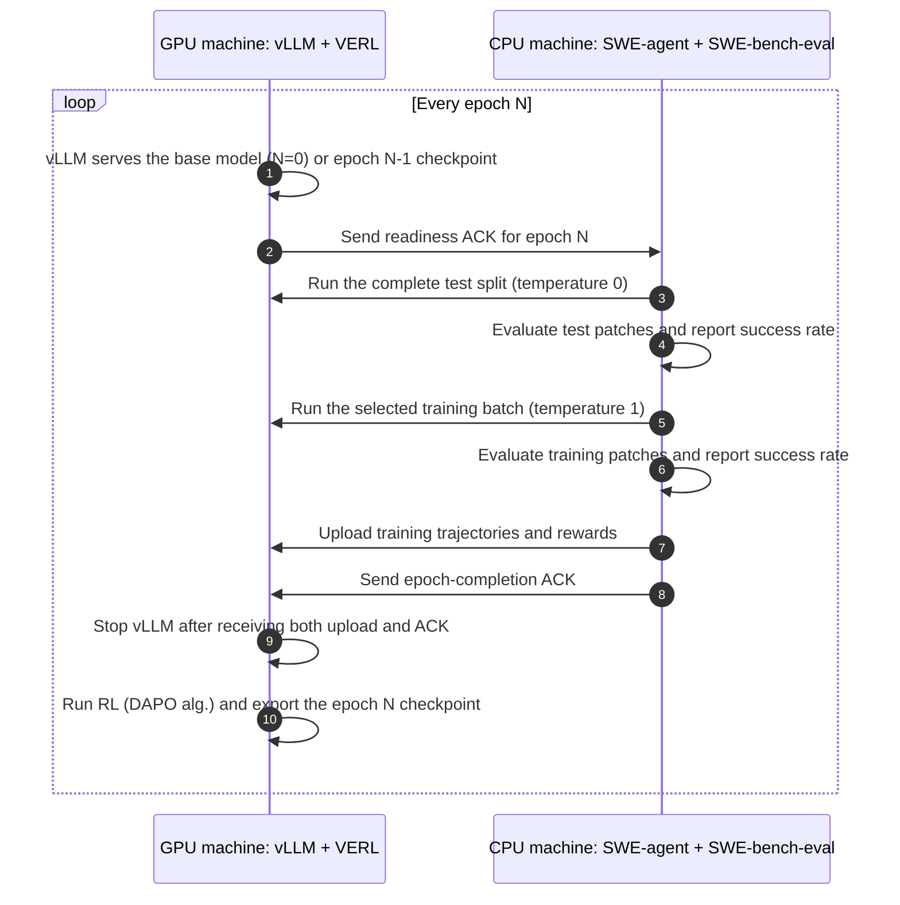

# RL with SWE-agent
This repo provides a minimal framework to sample SWE-agent trajectories and do RL on the trajs.

View [docs/demo.pdf](./docs/demo.pdf) for detailed algorithm explanation.

## Workflow

Each epoch alternates between trajectory collection on the CPU machine and
policy optimization on the GPU machine:



Every uploaded trajectory contains the per-round input token IDs, generated
token IDs, generated-token probabilities, and final evaluation result. RL
groups all samples from the same task, computes one normalized advantage per
trajectory, and applies that advantage to every generated token in the
trajectory. The newly exported checkpoint becomes the model served in the next
epoch.

## Environment setup

```
git clone --recursive https://github.com/njukenanli/SWE-agent-RL
```

### On CPU side

The CPU machine must be a physical machine or AWS VM that allows running docker inside. Containerized pods cannot run docker.

Minimun cpu machine requirements: 64 cpus, 500GB RAM, 8TB storage.

```bash
git clone https://github.com/njukenanli/SWE-agent-RL --recursive
cd SWE-agent-RL
git submodule update --init --recursive

cd cpu
python -m venv venv
source venv/bin/activate
cd sweagent
python -m pip install --upgrade pip && pip install --editable .
```

### On GPU side

The GPU workflow targets one x86-64 machine with 8 NVIDIA B200 GPUs. 

You can use a containerized pod with `verlai/verl:vllm024.latest` as the base image.
You can also use a GPU virtual machine and install docker and NVIDIA Container Toolkit yourself.

```bash
mkdir -p $HOME/Data # choose the dir to store model weights yourself.

git clone https://github.com/njukenanli/SWE-agent-RL --recursive
cd SWE-agent-RL
git submodule update --init --recursive

docker pull verlai/verl:vllm024.latest

# you'd better run it inside a tmux session.
tmux new -s exp

docker run --rm -it \
  --gpus all \
  --net=host \
  --ipc=host \
  --shm-size=512g \
  --ulimit memlock=-1 \
  --ulimit stack=67108864 \
  --cap-add=SYS_ADMIN \
  -v "$PWD/gpu:/workspace/gpu" \
  -v "$HOME/.cache/huggingface:/root/.cache/huggingface" \
  -v "$HOME/Data:/Data" \
  -w /workspace/gpu \
  --name verl-rft-rl \
  verlai/verl:vllm024.latest \
  bash
```

Inside the container, install the repository's VERL checkout and verify the
training and serving dependencies:

```bash
cd /workspace/gpu/verl
pip install --no-deps -e .

python - <<'PY'
import torch
import pandas
import pyarrow
import megatron.core
import transformer_engine
import transformers
import vllm

print("cuda:", torch.version.cuda)
print("gpus:", torch.cuda.device_count())
print("transformers:", transformers.__version__)
print("vllm:", vllm.__version__)
PY

cd /workspace/gpu
```

If the image is missing the Megatron dependency stack, install it before the
editable VERL install:

```bash
cd /workspace/gpu/verl
USE_SGLANG=0 USE_MEGATRON=1 bash scripts/install_vllm_sglang_mcore.sh
pip install --no-deps -e .
cd /workspace/gpu
```

## Run

### Link the two machines through ssh tunnel

As specified in gpu/.env and cpu/.env:
The CPU ACK server listens on port `8003`, and the GPU ACK server listens on port
`8004`. Port `5001` forwards vLLM API. Port `9001` forwards trajectory uploads from the CPU
machine to the GPU machine.

The ssh tunnel configurations are set in `cpu/tunnel.sh`. Modify `cpu/tunnel.sh` to adapt to your GPU machine ssh login configurations.
If the SSH connection is interrupted, the script retries indefinitely after a 10-second delay.
Set `SSH_TUNNEL_RETRY_DELAY_SECONDS` to use a different delay.

To start the ssh tunnel connection, from CPU machine, start a tmux session.
Inside the session, run:

```bash
bash cpu/tunnel.sh
```

Then run outside the tmux session:
```bash
lsof -i :9001
```
to verify the tunnel is alive.

### On CPU side

First, modify training and test configs in `cpu/sweagent/config/train.yaml` and `cpu/sweagent/config/test.yaml` to control SWE-agent behavior.

```bash
cd cpu

python main.py \
  --num_workers 1 \
  --train_set sweagent/datasets/verified-431.jsonl \
  --test_set sweagent/datasets/verified-50.jsonl \
  --batch_size 64 \
  --start_epoch 0
```

The sweagent side waits until GPU side is ready (receives ACK from GPU side) and start rollout.

`--batch_size` is the number of training task instances rolled out in each
epoch. The selection advances through `--train_set` by epoch and wraps at the end.
The selected instances overwrite `cpu/sweagent/temp.jsonl`, which is used only
for training rollouts. Test rollouts use the complete `--test_set` in every epoch.
GPU training consumes every task group in the uploaded `dapo.json`, so the
number of DAPO groups automatically matches the epoch's training batch size.
The GPU also derives the trajectories-per-group value from the uploaded JSON,
so it follows the CPU training configuration without a fixed sample count.
If an expected CPU sample directory or trajectory file is missing, the CPU
inserts `[]`; the GPU treats it as reward 0 with no trainable tokens.
DAPO uploads use up to five attempts, waiting 15 seconds between retryable
transport or temporary HTTP failures.
Keep the training batch smaller than the full dataset so each epoch performs
one RL mini_batch=full_batch=one weight-update step -- this is necessary for agentic RL.

## On GPU side

In side the container specified above:

```bash
# inside the tmux session, inside the container you've just started.
cd /workspace/gpu

bash main.sh \
  --epoch 120 \
  --data-dir /Data \
  --start_epoch 0
```

The code starts vllm, until CPU side sends ACK -- rollout ends and the cpu side uploads trajs to the gpu side. Then it starts verl training. When training ends the vllm is started again from the updated LM weights.

`--start_epoch` defaults to `0` on both machines. Set it to the same non-zero
value on the CPU and GPU to resume an interrupted run. For example,
`--epoch 120 --start_epoch 37` runs epochs 37 through 119. The GPU validates
and loads `/Data/model/epoch_36` for the first resumed rollout instead of the
base model. The previous model and checkpoint directories must remain under
the same `--data-dir`. The CPU uses epoch 37 for its dataset selection, output
directories, trajectory upload, and ACK handshake.
